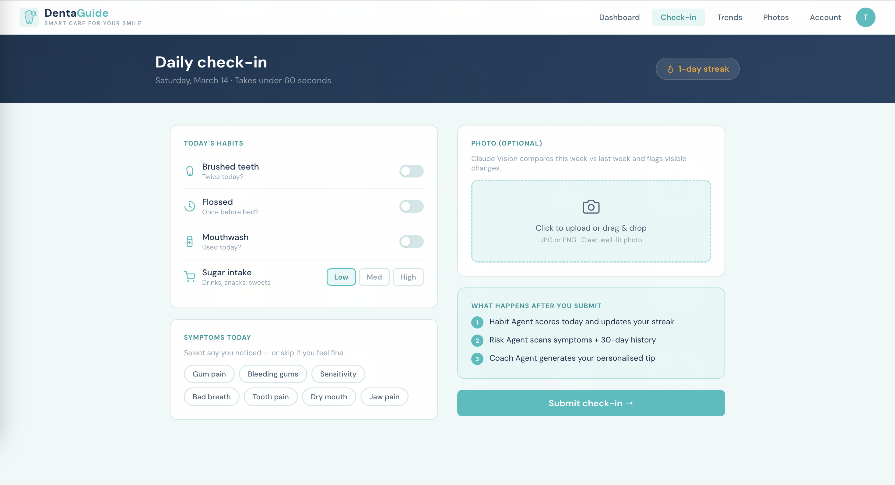
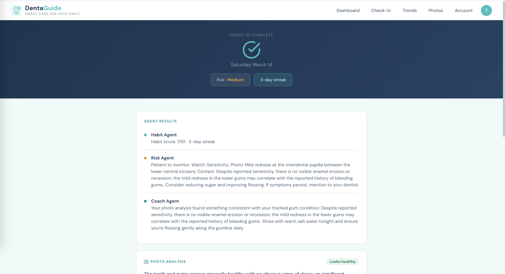
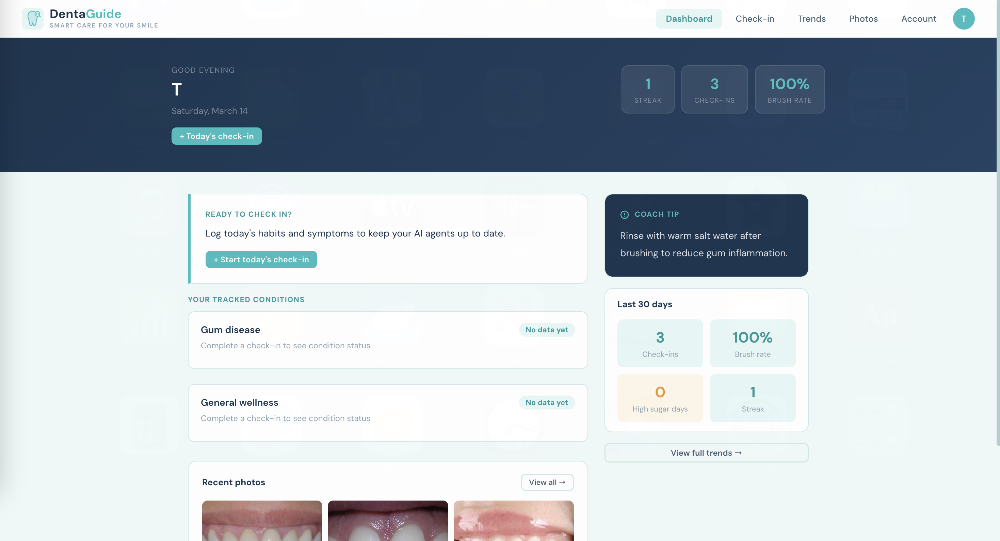

# DentaGuide 🦷

**Daily dental health monitoring, powered by agentic AI.**

Submitted to Gen AI Genesis 2026 Hackathon.

---

## Why we built this

Dental disease is almost entirely preventable, but only if you catch it early. Most people don't find out their habits are putting them at risk until they're already in pain and facing a bill they weren't expecting.

This hits hardest for people without dental insurance. No coverage means no routine cleanings, no early warnings, and small problems that quietly become expensive ones.

DentaGuide is that feedback loop. Under 60 seconds a day, it tracks your habits, symptoms, and weekly photos to catch risk patterns before they develop into something serious. For Sun Life members, it connects directly to a covered dentist when something needs attention. For everyone else, it gives them the early awareness that used to require a check-up they couldn't afford.

---

## Screenshots

### Daily check-in


### Check-in result — AI agents


### Dashboard


---

## How it works

Every daily check-in fires three AI agents simultaneously:

- **Habit Agent** — scores brushing, flossing, mouthwash, and sugar intake. Tracks streaks over time.
- **Risk Agent** — cross-references today's symptoms with 30 days of history and the user's specific tracked conditions. Flags patterns associated with early cavities, gingivitis, or enamel erosion.
- **Coach Agent** — generates one specific, actionable tip based on what the user is actually tracking. Personalised to their conditions, not a generic reminder to floss.

Users can also upload a weekly photo of their teeth. Gemini AI compares it to last week's and notes any visible changes such as gumline redness, discolouration, buildup as a screening tool, not a diagnosis.

---

## Running locally

### What you need

- Node.js 18+
- Python 3.11+
- A Supabase project
- An Gemini API key

### Backend

```bash
cd backend
python3.11 -m venv venv
source venv/bin/activate
pip install -r requirements.txt
uvicorn main:app --reload --port 8000
```

### Frontend

```bash
cd frontend
npm install
npm run dev
```

Open `http://localhost:5173`.

You'll need a `.env` in both `frontend/` and `backend/` with your Supabase and Gemini AI keys. 

---

## Team

Built at Gen AI Genesis 2026.

- **Tharjiha Suthekara** — backend, AI agents, daily check-in flow, photos
- **Jennifer Huang** — frontend, authentication, profile onboarding, trends, API integration
